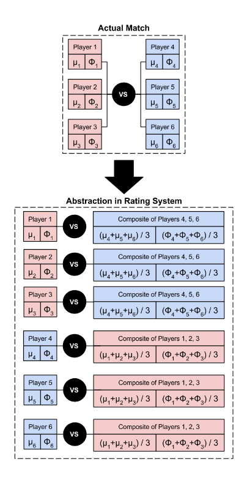

# aoe2league

Lockdown side project build for displayingin a spreadsheet stats and data about Age fo empire 2 players based only on unranked games they played together.
I tried to establish a elo(actually glicko 2) rating system based on those games too. Idea was to then build a matchmaking algorithm allowing more balanced games.
 
Needs an udpate googleapi authentication is not working as it used to

# Data
games data are coming from here https://aoe2.net/

# Glicko2 system ranking

Glicko 2 ranking system for multi playter team matches
See https://rhetoricstudios.com/downloads/AbstractingGlicko2ForTeamGames.pdf
As the study suggest I'm prefering to use Composite Opponent Update

